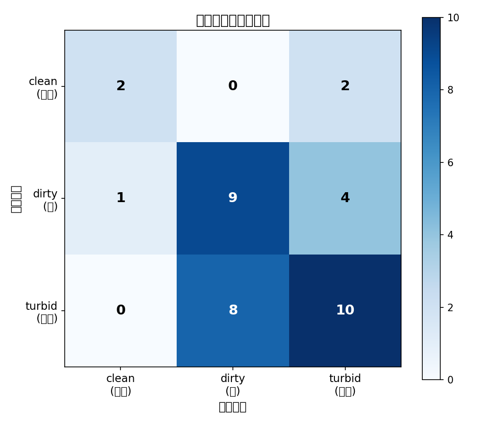
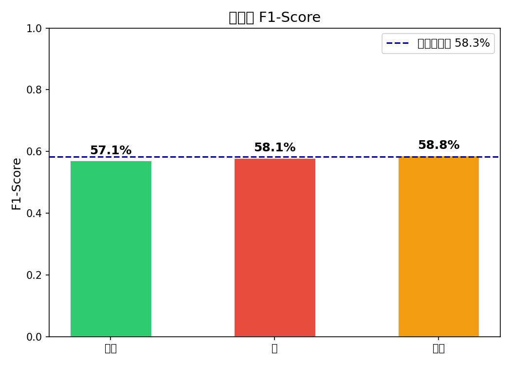
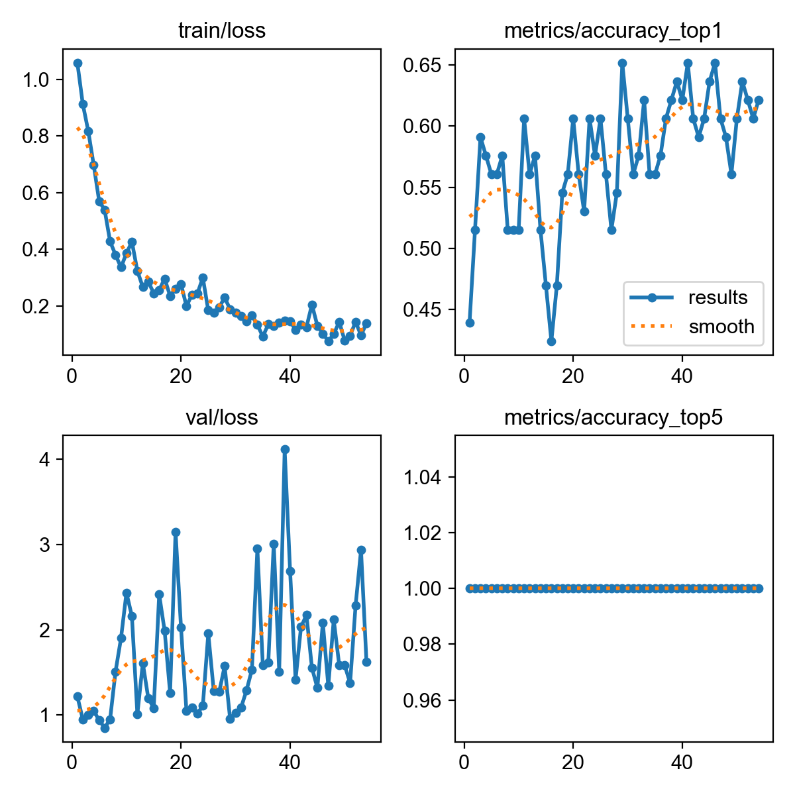

# 🌊 瓦磘溝水質影像辨識

**瓦磘溝行動研究社 × YOLOv8 影像分類**

[](https://colab.research.google.com/github/d225d225/Image-Cropping-for-Water-Quality-Classification/blob/main/water_quality_colab.ipynb)
[](https://www.python.org/)
[](https://github.com/ultralytics/ultralytics)
[](LICENSE)

---

## 專案介紹

「**瓦磘溝行動研究社**」是由永平高中學生組成的實作研究團隊，學生親自前往瓦磘溝進行田野調查，拍攝不同水質狀況的照片，並依照水質清澈程度手動分類。

本專案利用這批真實田野照片，訓練一個 AI 模型，讓電腦學會自動判斷照片中的水是乾淨、混濁還是髒的。訓練前照片已預先裁切，只保留水面部分，去除背景干擾。

**目標：**
> 讓 AI 模型看一張瓦磘溝的水面照片，就能自動判斷水質屬於哪一個等級。

---

## 資料集說明

### 三個水質類別

| 資料夾 | 類別名稱 | 說明 | 照片範例 |
|--------|---------|------|---------|
| `5/`（乾淨） | `clean` | 水體清澈透明 | — |
| `3/`（混濁） | `turbid` | 水體呈現混濁黃褐色 | — |
| `1/`（髒） | `dirty` | 水體呈現明顯污染、顏色深 | — |

### 資料來源

- 拍攝地點：瓦磘溝（新北市）
- 拍攝者：瓦磘溝行動研究社學生
- Google Drive 原始資料：[點此連結](https://drive.google.com/drive/folders/12OOjkS7GilRcvaVafh7NJKWk70mA1pDD)
- **前處理說明**：所有照片已預先裁切，只保留水面部分（去除天空、岸邊、建築物等背景），可直接用於訓練。

### 資料切分

| 子集 | 用途 | 比例 |
|------|------|------|
| `train/` | 模型學習用 | 70% |
| `val/` | 訓練過程即時評估 | 20% |
| `test/` | 最終獨立測試 | 10% |

> 完整照片存放於 Google Drive（見上方連結）。GitHub 只存放程式碼；照片因檔案較大不納入版本控制（已列入 `.gitignore`）。

---

## 為什麼用 YOLOv8 分類模型？

本專案使用 **YOLOv8 影像分類模型（yolov8s-cls）**，而非物件偵測模型。原因如下：

| 比較項目 | 物件偵測（YOLOv8-det） | 影像分類（YOLOv8-cls）✅ |
|---------|----------------------|------------------------|
| **標註方式** | 需要手動畫 bounding box | 只需用資料夾區分類別 |
| **照片前處理** | 需要讓模型找出水面位置 | 照片已裁切好，不需要 |
| **任務本質** | 找出「哪裡有水」 | 判斷「這張照片的水質」|
| **結果呈現** | 框框 + 類別名稱 | 類別 + 機率（更直觀）|
| **適合教學** | 需解釋 IoU、anchor 等概念 | 準確率、混淆矩陣容易理解 |

簡單說：因為照片已經裁切好只剩水面，我們只需要「判斷整張照片屬於哪一類」，這正是**影像分類**的任務，不需要物件偵測。

---

## 模型架構與訓練方式

### 模型

- **架構**：YOLOv8s-cls（YOLOv8 Small 分類版本）
- **預訓練**：ImageNet-1k（遷移學習，不需從零訓練）
- **輸入尺寸**：224 × 224 像素

### 訓練參數

| 參數 | 值 | 說明 |
|------|----|------|
| `epochs` | 100 | 最多訓練 100 輪 |
| `batch` | 32 | 每次更新使用 32 張圖 |
| `imgsz` | 224 | 輸入圖片縮放到 224×224 |
| `patience` | 20 | 20 輪沒進步就提早停止 |
| `optimizer` | AdamW（預設）| 自動調整學習率 |

---

## 如何重現訓練（Google Colab）

### 一鍵開啟

[](https://colab.research.google.com/github/d225d225/Image-Cropping-for-Water-Quality-Classification/blob/main/water_quality_colab.ipynb)

### 步驟

1. 點擊上方「Open in Colab」徽章
2. 上方選單 → **執行階段** → **變更執行階段類型** → 選 **T4 GPU**
3. 依序點擊每個步驟的 ▶ 執行鈕
4. 不需要寫任何程式，照順序執行完即可！

> 💡 Colab 提供免費 GPU，訓練時間約 5–15 分鐘。

---

## 訓練結果

> 在本機 CPU（Apple M1）訓練，54 epochs（早停），最佳模型在 epoch 29。

### 整體準確率

**測試集 Accuracy：58.3%**（21/36 張）

### 各類別指標

| 類別 | Precision | Recall | F1-Score |
|------|-----------|--------|----------|
| clean（乾淨） | 66.7% | 50.0% | 57.1% |
| dirty（髒） | 52.9% | 64.3% | 58.1% |
| turbid（混濁） | 62.5% | 55.6% | 58.8% |

### 混淆矩陣



### 各類別 F1



### 訓練曲線



### 結果解讀

- **最常見誤判**：把「混濁」誤判為「髒」（8 次）——兩類顏色接近，視覺差異小
- **準確率偏低的主因**：`clean` 只有 40 張，資料量嚴重不均衡
- **改善方向**：補充 clean 照片至 100 張以上，並改用 Colab GPU 訓練

> 📄 詳細分析請見 [results/analysis_report.md](results/analysis_report.md)

---

## 檔案說明

```
Image-Cropping-for-Water-Quality-Classification/
│
├── water_quality_colab.ipynb  # 主要 Colab 訓練 Notebook（Step 1–8）
├── prepare_dataset.py         # 本機資料整理腳本
├── analyze_results.py         # 本機結果分析腳本
├── requirements.txt           # Python 套件清單
├── PROMPT.md                  # 專案提示詞紀錄（教學用）
├── README.md                  # 本文件
└── .gitignore                 # 排除照片、模型等大型檔案
```

---

## 可以怎麼改善？

| 方向 | 說明 |
|------|------|
| 📸 增加資料量 | 每類至少 100 張，尤其是最少的類別 |
| 🎨 資料增強 | 旋轉、翻轉、亮度調整，讓模型更穩健 |
| 📷 統一拍攝條件 | 相同時間、光線、角度，減少背景干擾 |
| 🔧 換更大模型 | `yolov8m-cls` 或 `yolov8l-cls` 準確率更高 |
| 🏷️ 細化標籤 | 例如區分「輕微混濁」與「嚴重混濁」 |

---

## 技術環境

- Python 3.10+
- [Ultralytics YOLOv8](https://github.com/ultralytics/ultralytics)
- Google Colab（T4 GPU）
- Google Drive（資料與模型儲存）

---

## 授權

本專案程式碼採用 [MIT License](LICENSE)。照片版權屬於瓦磘溝行動研究社，非經授權不得商業使用。

---

## 🔬 對照實驗結論：裁切水面 vs 原始照片

本專案（**裁切水面**）與姊妹專案 [water-quality-yolo](https://github.com/d225d225/water-quality-yolo)（**原始照片**）使用同一批瓦磘溝照片、同樣的 YOLOv8s-cls 模型，唯一差別是「要不要先把照片裁切到只剩水面」。

| 項目 | 本專案（裁切水面） | 姊妹專案（原始照片） |
|------|------------------|------------------|
| 輸入 | 只留水面 | 完整照片（含背景） |
| 前處理 | 每張需手動裁切 | 無，直接訓練 |
| 測試準確率 | 58.3% | **約 80%** 🏆 |

### 本實驗的假設與結果

本專案的出發點是一個很自然的假設：

> 「天空、河岸、建築物等背景是雜訊，把它們裁掉、只留水面，AI 應該能更專注判斷水質，準確率會更高。」

**但實驗結果推翻了這個假設**——裁切版只有 58.3%，反而比不裁切的原始版（約 80%）低了 20 個百分點。

可能原因：
1. **背景其實是有用的線索**：河岸、水草、陽光反光、周遭環境，這些「情境」幫助 AI 判斷水質。裁掉等於丟掉資訊。
2. **裁切後資訊量變少**：只剩水面紋理，乾淨水與混濁水的差異本來就微妙，少了對照物更難分。
3. **裁切引入不一致**：每張裁切範圍、比例不同，反而成為新的雜訊來源。
4. 最常見的錯誤是把「混濁」誤判成「髒」，顯示少了背景後類別更難區分。

### 這個專案的價值

雖然準確率輸給原始照片版，但本專案不是白做——它是一個漂亮的**對照實驗**：

> **看似合理的假設，必須用數據驗證，不能只靠直覺。**

這正是科學研究最重要的精神。對學生而言，這是一個比「成功」更珍貴的學習：一個被數據否定的假設，本身就是有意義的研究成果。
